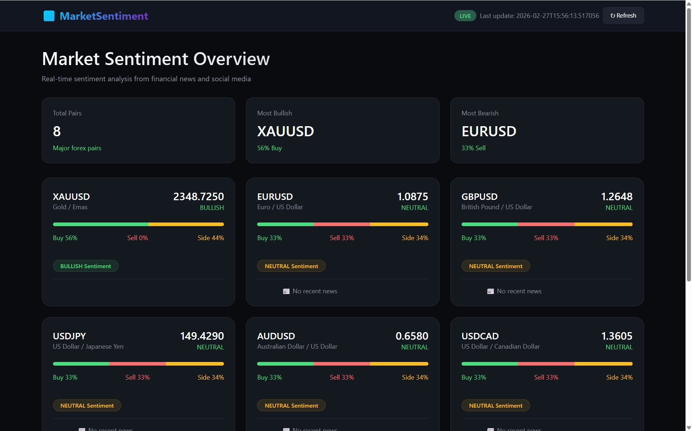

# 📊 Market Sentiment Web App


Aplikasi web real-time untuk melihat sentimen pasar forex dan emas berdasarkan analisis berita finansial. Menampilkan persentase BUY/SELL/SIDEWAYS untuk berbagai pair forex.



## 📋 Daftar Isi
- [Fitur](#fitur)
- [Demo](#demo)
- [Teknologi](#teknologi)
- [Instalasi](#instalasi)
- [Konfigurasi](#konfigurasi)
- [Cara Penggunaan](#cara-penggunaan)
- [Struktur File](#struktur-file)
- [API Endpoints](#api-endpoints)
- [Screenshot](#screenshot)
- [Troubleshooting](#troubleshooting)
- [Kontribusi](#kontribusi)
- [Lisensi](#lisensi)

## ✨ Fitur

- ✅ **Real-time Sentiment Analysis** - Analisis sentimen dari berita finansial terkini
- ✅ **8 Major Forex Pairs** - XAUUSD, EURUSD, GBPUSD, USDJPY, AUDUSD, USDCAD, NZDUSD, USDCHF
- ✅ **Persentase Buy/Sell/Sideways** - Tampilan visual dan numerik
- ✅ **Harga Real-time** - Data harga terkini (simulasi real-time)
- ✅ **News Ticker** - Berita terbaru untuk setiap pair
- ✅ **Detail View** - Analisis mendalam dan artikel terkait
- ✅ **Auto Refresh** - Update otomatis setiap 5 menit
- ✅ **Responsive Design** - Mobile friendly
- ✅ **Dark Mode** - Tampilan nyaman untuk trading

## 🎥 Demo

### Tampilan Utama


### Detail Pair


## 🛠 Teknologi

### Backend
- **Python 3.8+** - Bahasa pemrograman utama
- **Flask 2.3+** - Web framework
- **Requests** - HTTP client untuk API
- **Python-dotenv** - Manajemen environment variables

### Frontend
- **HTML5** - Struktur halaman
- **CSS3** - Styling dengan tema dark mode
- **JavaScript** - Interaktivitas dan data fetching
- **Flexbox/Grid** - Layout responsif

### API
- **Alpha Vantage API** - Sumber data berita dan sentimen

## 🔧 Instalasi

### Prasyarat
- Python 3.8 atau lebih baru
- Pip (Python package manager)
- Git (opsional)

### Langkah-langkah Instalasi

1. **Clone repository**
```bash
git clone https://github.com/username/market-sentiment-web.git
cd market-sentiment-web
```

2. **Buat virtual environment** (opsional tapi direkomendasikan)
```bash
# Windows
python -m venv venv
venv\Scripts\activate

# Linux/Mac
python3 -m venv venv
source venv/bin/activate
```

3. **Install dependencies**
```bash
pip install -r requirements.txt
```

4. **Buat file .env** untuk menyimpan API Key
```bash
echo "ALPHA_VANTAGE_KEY=your_api_key_here" > .env
```

5. **Jalankan aplikasi**
```bash
python app.py
```

6. **Buka browser** dan akses `http://localhost:5000`

## ⚙️ Konfigurasi

### Mendapatkan API Key Alpha Vantage

1. Buka [Alpha Vantage](https://www.alphavantage.co/support/#api-key)
2. Isi form dengan nama dan email
3. Cek email untuk mendapatkan API Key
4. Masukkan key ke file `.env`:
```
ALPHA_VANTAGE_KEY=K9X7Z2M5W8R4Q1P6
```

### Konfigurasi Tambahan

Di file `app.py`, Anda bisa mengubah:

```python
# Durasi cache (default: 300 detik / 5 menit)
CACHE_DURATION = 300

# Daftar pair forex
FOREX_PAIRS = [
    {'symbol': 'XAUUSD', 'name': 'Gold / Emas'},
    # Tambah atau kurangi pair sesuai kebutuhan
]
```

## 📖 Cara Penggunaan

1. **Buka aplikasi** di browser
2. **Lihat overview** semua pair dengan persentase sentimen
3. **Klik card pair** untuk melihat detail lengkap
4. **Baca berita terbaru** yang mempengaruhi sentimen
5. **Refresh manual** dengan klik tombol refresh atau tunggu auto-refresh

### Interpretasi Sentimen

| Persentase | Arti |
|------------|------|
| **Buy > 50%** | Sentimen bullish, mayoritas berita positif |
| **Sell > 50%** | Sentimen bearish, mayoritas berita negatif |
| **Buy ≈ Sell** | Sentimen netral, pasar ragu-ragu |
| **Sideways tinggi** | Banyak berita netral, konsolidasi |

## 📁 Struktur File

```
market-sentiment-web/
│
├── app.py                 # Aplikasi Flask utama
├── requirements.txt       # Dependencies Python
├── .env                   # API Keys (buat sendiri)
├── README.md              # Dokumentasi
├── preview.png            # Screenshot preview (opsional)
│
├── templates/             # Folder untuk HTML
│   └── index.html         # Halaman utama
│
└── static/                # Folder untuk aset statis (opsional)
    ├── css/
    │   └── style.css
    ├── js/
    │   └── script.js
    └── images/
```

## 🔌 API Endpoints

### GET /
Halaman utama website

### GET /api/sentiment
Mendapatkan data sentimen untuk semua pair

**Response:**
```json
{
  "pairs": [
    {
      "symbol": "XAUUSD",
      "name": "Gold / Emas",
      "price": 2345.60,
      "sentiment": {
        "buy": 45,
        "sell": 40,
        "sideways": 15
      },
      "direction": "BULLISH",
      "headlines": [...],
      "last_update": "14:30:25"
    }
  ],
  "total_pairs": 8,
  "last_update": "2024-01-15T14:30:25"
}
```

### GET /api/sentiment/{symbol}
Mendapatkan detail untuk satu pair

**Response:**
```json
{
  "symbol": "XAUUSD",
  "name": "Gold / Emas",
  "price": 2345.60,
  "sentiment": {
    "buy": 45,
    "sell": 40,
    "sideways": 15
  },
  "articles": [
    {
      "title": "Gold Prices Steady...",
      "source": "Reuters",
      "sentiment_label": "Bullish",
      "summary": "..."
    }
  ],
  "last_update": "2024-01-15T14:30:25"
}
```

## 📸 Screenshot

### Halaman Utama


### Detail Pair


### Mobile View


## 🔍 Troubleshooting

### Error: "Module not found"
```bash
pip install -r requirements.txt
```

### Error: "API Key invalid"
- Cek file `.env` sudah benar
- Pastikan API Key masih aktif
- Coba gunakan key 'demo' untuk testing

### Error: "Too many requests"
Alpha Vantage gratis terbatas 5 request/menit. Tunggu beberapa saat.

### Web tidak muncul
- Pastikan Flask running: `python app.py`
- Buka `http://127.0.0.1:5000` bukan `localhost:5000`
- Cek port 5000 tidak digunakan aplikasi lain

### Data tidak muncul
- Cek koneksi internet
- Cek console browser untuk error JavaScript
- Restart aplikasi

## 🤝 Kontribusi

Kontribusi selalu diterima! Berikut cara berkontribusi:

1. **Fork** repository ini
2. **Buat branch** baru: `git checkout -b fitur-baru`
3. **Commit** perubahan: `git commit -m 'Menambah fitur X'`
4. **Push** ke branch: `git push origin fitur-baru`
5. Buat **Pull Request**

### Ide Pengembangan
- [ ] Tambahkan lebih banyak pair forex
- [ ] Integrasi dengan Twitter sentiment analysis
- [ ] Tambahkan chart harga historis
- [ ] Fitur notifikasi perubahan sentimen
- [ ] Export data ke CSV
- [ ] Multi-language support

## 📄 Lisensi

Project ini dilisensikan di bawah **MIT License** - lihat file [LICENSE](LICENSE) untuk detail.

```
MIT License

Copyright (c) 2024 [Nama Anda]

Permission is hereby granted, free of charge, to any person obtaining a copy
of this software and associated documentation files (the "Software"), to deal
in the Software without restriction, including without limitation the rights
to use, copy, modify, merge, publish, distribute, sublicense, and/or sell
copies of the Software, and to permit persons to whom the Software is
furnished to do so, subject to the following conditions:

The above copyright notice and this permission notice shall be included in all
copies or substantial portions of the Software.

THE SOFTWARE IS PROVIDED "AS IS", WITHOUT WARRANTY OF ANY KIND, EXPRESS OR
IMPLIED, INCLUDING BUT NOT LIMITED TO THE WARRANTIES OF MERCHANTABILITY,
FITNESS FOR A PARTICULAR PURPOSE AND NONINFRINGEMENT. IN NO EVENT SHALL THE
AUTHORS OR COPYRIGHT HOLDERS BE LIABLE FOR ANY CLAIM, DAMAGES OR OTHER
LIABILITY, WHETHER IN AN ACTION OF CONTRACT, TORT OR OTHERWISE, ARISING FROM,
OUT OF OR IN CONNECTION WITH THE SOFTWARE OR THE USE OR OTHER DEALINGS IN THE
SOFTWARE.
```

## 🚀 Deployment

### Deploy ke PythonAnywhere (Gratis)

1. Upload file ke PythonAnywhere
2. Setup virtual environment
3. Konfigurasi WSGI file
4. Set environment variables

### Deploy ke Heroku

```bash
# Buat Procfile
echo "web: gunicorn app:app" > Procfile

# Deploy
heroku create nama-app
git push heroku main
heroku config:set ALPHA_VANTAGE_KEY=your_key
```

### Deploy ke Railway

1. Connect repository ke Railway
2. Set environment variables
3. Deploy otomatis

## 📞 Kontak

- **Nama**: [Nama Anda]
- **Email**: [email@example.com]
- **GitHub**: [github.com/username](https://github.com/username)
- **LinkedIn**: [linkedin.com/in/username](https://linkedin.com/in/username)

## 🙏 Credit

- **Alpha Vantage** - Penyedia API data finansial
- **Flask** - Web framework
- **Font Awesome** - Icons (jika digunakan)

---

## 📝 Catatan Rilis

### v1.0.0 (2024-01-15)
- Rilis pertama
- Fitur dasar sentiment analysis
- Support 8 pair forex
- Auto refresh 5 menit

### v1.1.0 (Coming Soon)
- Chart historis
- Notifikasi real-time
- Export data

---

**⭐ Jangan lupa beri star jika project ini bermanfaat!**

[](https://github.com/IlhamXkyo/sentimen-forex-web/stargazers)
[](https://github.com/IlhamXkyo/sentimen-forex-web/network/members)
